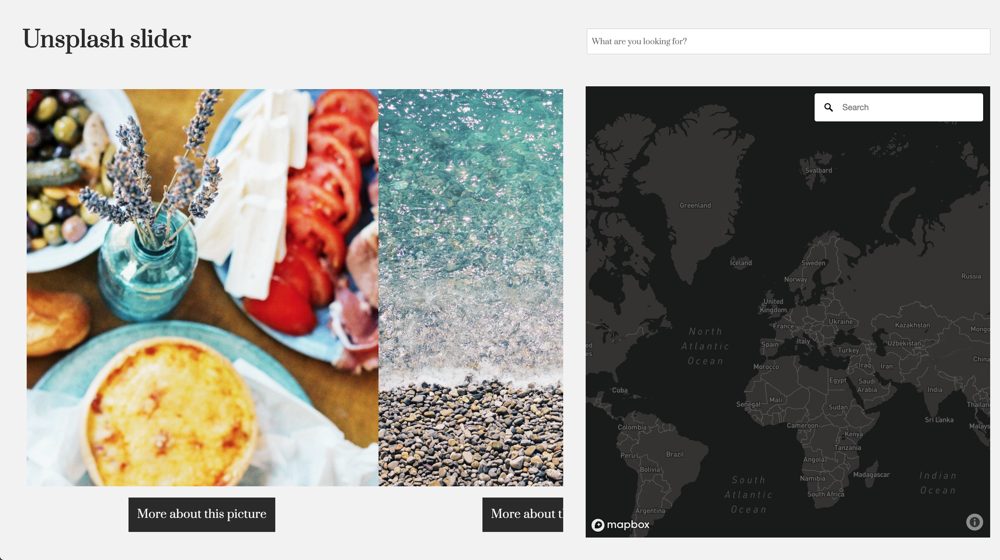
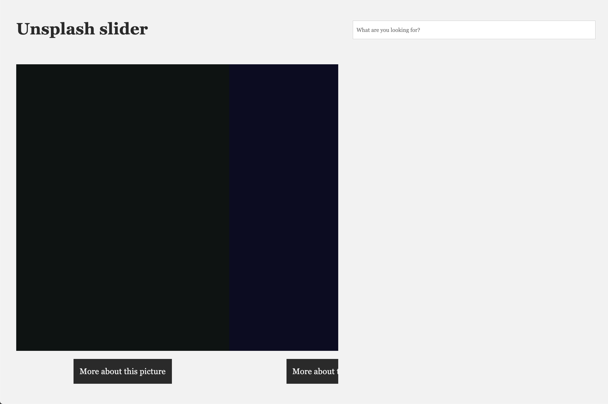
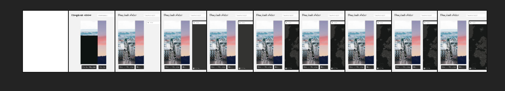
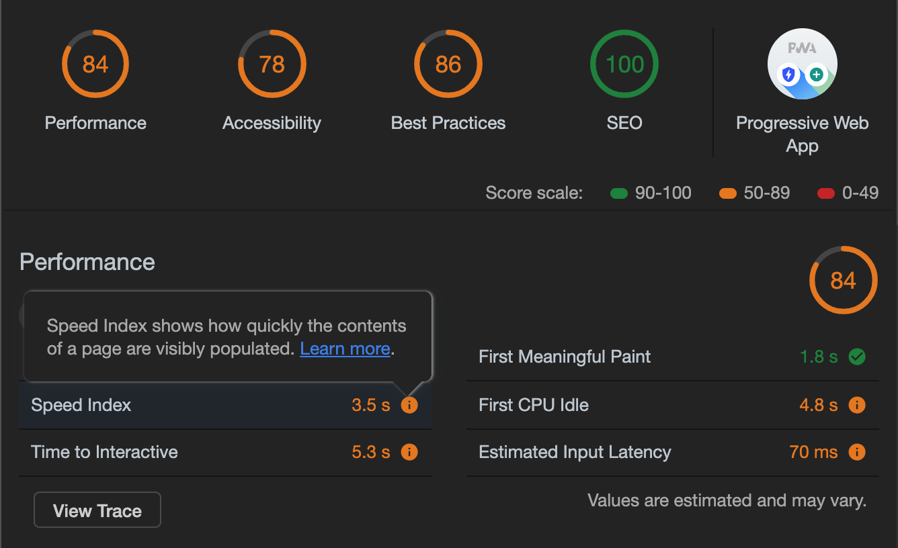
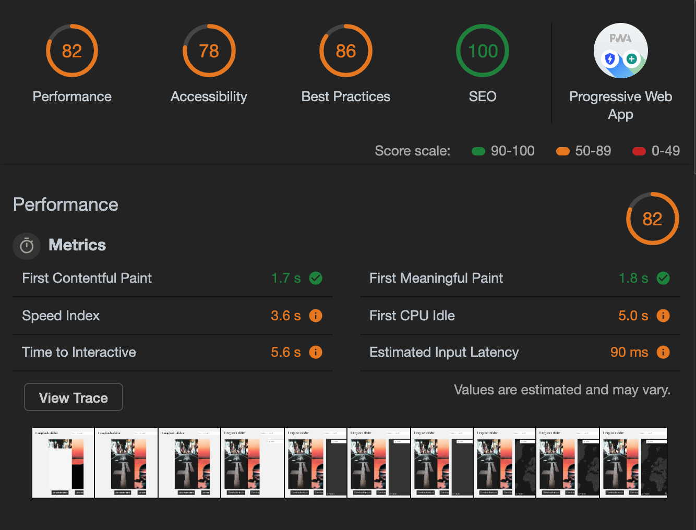

# | Performance Matters |

**Here I improved the performance of my application which uses images from Unsplash, to create a better user experience. Mainly by switching from client to server side rendering with Express**

[Link to website](https://unsplash-slider.herokuapp.com/)




## Table of Contents
* **[How to install](#how-to-install)** 
* **[Walktrough the application](#walk-trough-the-application)** 
* **[Performance features](#performance-features)**
* **[Service worker](#service-worker)**
* **[Learning process](#learning-process)**
* **[Resources](#resources)**
* **[Credits](#credits)**
* **[Checklist](#checklist)**
* **[License](#license)**

## How to install

Before installing make sure you have installed node.js and npm.
Choose or make a new directory.
Load the template into your directory.

```bash
git clone https://github.com/chelseadoeleman/performance-matters-1819.git
```

Make sure you are in the right directory 
```bash
cd performance-matters-1819
```

Check if you have the latest version of npm.
Install the dependencies in [package.json](./package.json)
```bash
npm install
```

## Walktrough the application

In the application you can scroll through a slider, to see different images that can be found on [unsplash](https://unsplash.com/). Next to the unsplash image slider you can find a map of the world. When clicking on an image, you will get redirected to that location where the photo was either uploaded or taken. Depending on what location the author has given their photo(s). 

The Application also has a search function, to get the images you would like to see. And when clicking on the link under the photo you are able to view more details about that picture.

**NOTE** Right now there is an alert that tells you when the location is unknown, this has yet to be changed because it can be quite irritating. Sorry!


## Performance features

<details>
  <summary> Image loading</summary>

  #### Image loading

  When entering the page you weren't able to see what content will be shown on the page because of the loading time. So I set a standard width of an image, so that the outline of those images will be shown on load. I also picked a color which is defined in the API as a specific color for that image. Whether this is the most prominent color in that image I don't know for sure.



</details>

<details>
  <summary> First view</summary>

  #### First view

  Image loading is also a part of this, but I also made sure the textual content of a page is shown on load. By setting a default font, the user will get the content faster, eventhough not everything is functional yet. Now the user is able to get their contest fast. The first content is painted in about **500ms**. Which is quite fast, considering is load all the images which take up to **73 MB**, definitely excessive.

  

</details>


<details>
  <summary> Perceived performance</summary>

  #### Perceived performance

  To make the page load faster I minified and compressed by files, so the loading time will be faster. I also set ```srcset``` and ```sizes``` on the images, so that when the user is using a smaller viewport smaller images will be inserted instead of an higher resolution. By doing this the transferred files went from 70.6mb to 13.2mb. This is a much smaller amount. And decreases the loading time drastically. I compressed the files with brotli and gzip.

  After I set srcset and sizes the statics of progressive web app became drastically worse, than before. This is because it now loads, more image sizes. So instead of **73 MB** it now loads up to **82 MB**. However on a mobile device it will be able to load faster, so it is still a win. Because images change all the time the sometimes the transfered files will be more MB or less, then specified above.

  Overall I didn't see much change when everything enhanced, because the images are the main reason it is not a very fast application. Also Mapbox takes some time load, which is unfortunate.

  To give you an better insight in how wonky it can be I performed an audit, just 1 minute after the other. The end results were both completely different.

  

  


</details>


## Service worker

I also added a Service worker for the user to be able to view these pages even in an offline state, or they will receive a offline html page which tells them they are offline. However if the first load was an succes, they should already have the index page. Detail pages are also cached in the service worker.

I wanted to some more functionality to my service worker, but due to time management wasn't able to. I would really wanted to cache the images, because this takes up a lot of time to load. If I did implement this, the user would still be able to slide through some of the images that were cached beforehand offline. Thus making sure they can still use the application to an certain extent. The offline page doesn't do much at the moment, just telling the user they are offline and hopefully triggering them to turn on their internet connection or browse further when they are connected again to the internet.

## Learning process

Because I was sick during the first week I had a lot of catching up to do. In the beginning I really struggled with node, to get my application up and running server-side with **Express** and **EJS**. Especially making the method work accordingly I found quite difficult. 

After that I dived deeper into the performance of my application by really thinking about what features could improve the performance of my application like ```srcset``` and ```sizes```. And making sure the user was able to see something fast, instead of just an blank page. The hardest part for me was compression. I also ran into some errors like **RegeneratioRuntime()** error, using gulp.

The service worker feels still kinda magical to me. Which made it harder to understand the code, but in the end I think I understand it a bit better after the presentation of Declan where he did some livecoding. I do understand how a service worker can improve the performance and making a progressive web app. I also added a manifest file, which was quite fun to do!

## Resources

**API**
* [Unsplash](https://unsplash.com/developers)
* [Mapbox](https://www.mapbox.com/)

**Resources**
* [Express](https://expressjs.com/)
* [Node](https://nodejs.org/en/)
* [Helmet](https://github.com/helmetjs/helmet)
* [Node-fetch](https://www.npmjs.com/package/node-fetch)
* [Babel-polyfill](https://cdnjs.com/libraries/babel-polyfill)
* [Gulp](https://gulpjs.com/)
* [Ejs](https://ejs.co/)
* [Nodemon](https://nodemon.io/)
* [Service worker](https://developers.google.com/web/fundamentals/primers/service-workers/#you_need_https)


## Checklist
- [x] Set up node server with express.
- [x] Implement templating with ejs.
- [x] Render detailpage and searchfuntion.
- [x] Make sure the user is able is able to see content directly (first view)
- [x] Set fixed ration image as an placeholder, for the image to load.
- [x] Compress files with Brotli and Gzip
- [x] Minify javascript and css.
- [x] Subset font.
- [x] Critical css.
- [x] Add a service worker.
- [x] Render an offline html page.
- [x] Add manifest.
- [ ] Add HTTP2.
- [ ] Download images to compress them.
- [ ] Cache images in service worker.

## License
This repository is licensed as [MIT](LICENSE) by [Chelsea Doeleman](https://github.com/chelseadoeleman).
